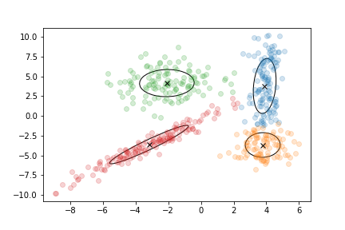

===============
Getting started
===============

Installation
=============

The package is registered on PyPI. It can be installed with the following command: ::

    $ pip install megamix

If you want to install it manually, you can find the source code at https://github.com/14thibea/Stage_ENS.

MeGaMix relies on external dependencies. The setup script should install them automatically, but you may want to install them manually. The required packages are:

* NumPy 1.11.3 or newer
* scipy 0.18.1 or newer
* h5py 2.6.0 or newer
* joblib 0.11 or newer
* scikit-learn 0.18.1 or newer

.. note::
    
	Scikit-learn is being used for only one function in the K-means algorithm which will be replaced soon to avoid this dependency.
	
Description
===========

The MeGaMix package (Methods for Gaussian Mixtures) allows Python developpers to fit different kind of models on their data.
The different models are clustering methods of unsupervised machine learning. Four models have been implemented, from the most simple to the most complex:

* K-means
* GMM (Gaussian Mixture Model)
* VBGMM (Variational Bayesian Gaussian Mixture Model)
* DP-VBGMM (Dirichlet Process on Variational Bayesian Gaussian Mixture Model)

What will you be able to do ?
-----------------------------

The main idea of clustering algorithms is to create groups by gathering points that are close to each other.
A cluster will have three main parameters:

* A mean : the mean of all the points that belong to the cluster
* A weight : the number of points that belong to the cluster
* A covariance (except for K-means) : an matrix which specifies the form of the cluster

    A graphical example of a gaussian mixture model

How do the algorithms work ?
----------------------------

After the initialisation, the algorithms alternate between two steps, the E step (Expectation) and the M step (Maximisation).
During the E step, the algorithm will compute the probability for each point to belong to each cluster. It will produce an array of 'responsibilities'. At the ith row and the jth column corresponds the probability of the ith point to belong to the jth cluster.

.. note::

    This is not the case with K-means where we are not working with probabilities but with labels. A point belongs completely to a cluster or doesn't belong to it (this is called hard assignement).

Then during the M step, the algorithm will re-estimate the parameters of the model in order to maximize a convergence criterion.
Finally the algorithm will stop if the difference between the value of the convergence criterion of the current and the previous is less than a threshold fixed by the user.

This is summarized in the following pseudo-code:

    initialize(points)
    while(cc-cc_previous > tol):
        cc_previous = cc
        responsabilities = E_step(points,parameters)
        parameters = M_step(responsabilities,points)
        cc = convergence_criterion(points,responsabilities,parameters)
		

Basic usage
===========

.. include:: exemple.py
   :code: python